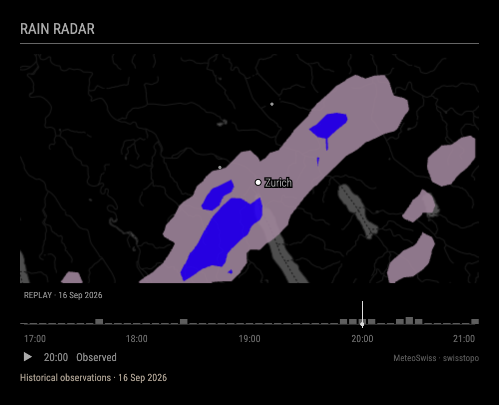
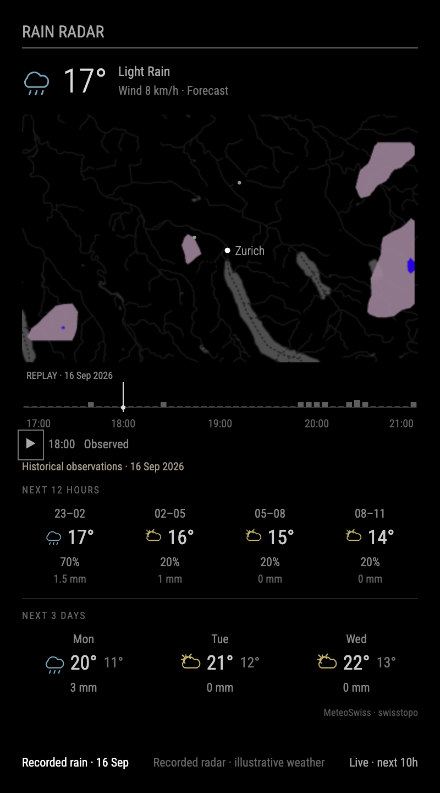

# MMM-RainRadar

A minimal **MagicMirror² rain radar for Switzerland and nearby areas**, using
MeteoSwiss observations and forecasts. A wide, dark map sits above precipitation
bars for your configured location. The chart doubles as the animation scrubber.



- Native **RAIN RADAR** module header and separator.
- Smooth geographic contours, subtle rivers and configurable labelled markers.
- One hour of past observations and a **10-hour forecast** by default.
- Bars represent precipitation intensity classes at your chosen location.
- Home-focused playback: fast through dry frames, slower over rain, with readable arrival/peak holds.
- A simple home dot and shaded local rain windows; optional arrival/clearing summary.
- Pause, drag-to-select and keyboard navigation.
- Optional integrated current weather, 12-hour outlook and three-day forecast.
- Multiple instances, cached downloads, partial-frame and stale-data indicators.
- No API key, browser framework, native add-on, build step or runtime npm dependencies.

The provider covers Switzerland and surrounding radar/model territory, **not the
world**. This module shows precipitation intensity; it does not currently display
snow type, freezing rain or lightning layers. The optional weather panels can
show snow and thunderstorm condition icons. A forecast is not
an observation. The chart describes a radar/model grid cell, not a doorstep sensor.

## Install

Clone into your MagicMirror modules directory:

```sh
cd ~/MagicMirror/modules
git clone https://github.com/mkubicek/MMM-RainRadar.git
```

Then add to `config/config.js`:

```js
{
  module: "MMM-RainRadar",
  position: "bottom_left",
  header: "RAIN RADAR",
  config: {
    location: { latitude: 47.3769, longitude: 8.5417, label: "Zurich" },
    mapCenter: { latitude: 47.39, longitude: 8.53 },
    mapSpanKm: 48,
    width: 460,
    height: 230,
    forecastHours: 10,
    markers: [
      { latitude: 47.3769, longitude: 8.5417, label: "Zurich" },
      { latitude: 47.45038, longitude: 8.5624, label: "Airport", showLabel: false }
    ]
  }
}
```

Replace `location` with the point you want the bars to describe. `mapCenter` can
be different, allowing nearby landmarks to remain in view. Coordinates are WGS84
latitude/longitude, not street addresses. The default example uses public Zurich
city-centre coordinates. Keep your private location in your own MagicMirror config.

Restart MagicMirror using your usual process manager. **No `npm install` is needed
on the mirror.** The runtime supports Node.js 10.24+ and MagicMirror² 2.18+; a current
supported MagicMirror release is recommended for new installations. Tested on a
Raspberry Pi 4 with Node 10.24 and Electron 16.0.5, as well as Node 22 locally.

The default title is `RAIN RADAR`; MagicMirror's `header` setting can override it.
Use `showHeader: false` to hide it. The module inherits your mirror's font and does
not restyle other modules. Set `width` to fit the column where you install it.

## Integrated weather forecast

*The narrow-layout screenshot combines recorded radar with illustrative weather values from the offline demo.*



Enable `showWeather: true` for MeteoSwiss local weather: the current-hour temperature
and wind forecast, four three-hour forecast blocks, and the next three calendar days,
starting tomorrow. No API key, account or subscription is required. For a narrow mirror
column, use `width: 360`, `height: 150`, `forecastHours: 12`.

The nearest MeteoSwiss postal-code forecast point is selected from your configured
coordinates (maximum distance 50 km). The map and rain bars still use your exact
configured point; local weather represents a nearby forecast location.

Each hourly column covers a three-hour interval, showing the temperature during its
final hour, the **probability of precipitation over those three hours**, and total
precipitation in mm. The twelve-hour outlook starts at the next clock hour. Missing
probabilities remain unavailable rather than becoming zero. Daily columns show high/low
temperature and precipitation amount; no daily probability or feels-like temperature is
invented. All temperatures are Celsius and wind is km/h. The top row is explicitly a
forecast, not a reading from a weather station at your home.

The adapter combines MeteoSwiss's compact **website local-forecast JSON feed** with
three-hour probabilities from its documented **open-data CSV product**. The JSON endpoint
is undocumented and could change, like the radar endpoint. Weather symbols use original
SVG drawings mapped from MeteoSwiss condition codes, not MeteoSwiss's proprietary graphics.
Daily totals use Swiss calendar days; displayed hourly times use `timeZone`.

For Raspberry Pi efficiency, the helper downloads the small point forecast rather than
whole-country forecast grids. It locates the selected point in the probability CSV using
bounded HTTP byte-range requests (at most 20 search probes and one surrounding block),
and checks ordering/completeness before accepting it. If byte ranges or probabilities
are unavailable, temperature, wind and daily forecasts remain usable. The point catalogue
loads once; probability extractions are cached by source run. Forecasts refresh every
15 minutes and reuse unchanged versions. The browser receives only a short hourly window
and daily summaries; forecast panels never redraw with radar animation.

Failed refreshes retain the last successful forecast with a notice. Forecasts more than
two hours past their source update are marked stale. Radar and local forecasts can have
different update times/horizons even though both come from MeteoSwiss. Set
`showWeather: false` for a radar-only widget.

[Official local forecast data documentation](https://opendatadocs.meteoswiss.ch/e-forecast-data/e4-local-forecast-data)

## Configuration

All keys below go inside `config` unless noted. No address lookup or GPS permission
is required. Invalid settings produce an explanatory message in the widget.

| Setting | Default | Meaning |
| --- | --- | --- |
| `location` | Zurich city centre | `{ latitude, longitude, label }`; point sampled by bars |
| `mapCenter` | `null` | `{ latitude, longitude }`; `null` centres on `location` |
| `mapSpanKm` | `48` | East–west span, 10–700 km; north–south span follows the aspect ratio |
| `width`, `height` | `460`, `230` | Map size in CSS pixels; allow about 110 px for header/chart/footer, plus optional summary/weather panels |
| `pixelRatio` | `1` | Rendering scale, 1–2; keep 1 for a Pi, use 2 for a high-DPI display |
| `markers` | `[]` | Up to 20 `{ latitude, longitude, label, showLabel }` objects |
| `showLocation` | `true` | Draw a bright home dot |
| `showHomeSummary` | `false` | Opt into a home status/arrival summary and map caption; the default keeps the view minimal |
| `showLocationLabel` | `false` | Show the location's label |
| `showMarkerLabels` | `true` | Allow marker labels; individual `showLabel: false` still hides them |
| `mapStyle` | `"rivers"` | `"rivers"`, `"lakes"`, or `"none"` |
| `mapOpacity`, `rainOpacity` | `0.65`, `0.9` | Opacity, 0–1 |
| `title`, `showHeader` | `"RAIN RADAR"`, `true` | Default native module header |
| `showControls` | `true` | Show the play/pause button; chart remains interactive |
| `showWeather` | `false` | Enable the integrated MeteoSwiss panels; no API key |
| `showLegend` | `false` | Show a small muted mm/h intensity scale |
| `pastMinutes` | `60` | Observed history to request, 0–180 minutes |
| `forecastHours` | `10` | Forecast outlook, 0–24 hours, subject to upstream availability |
| `frameStepMinutes` | `5` | Minimum interval between frames, 5–60 minutes; 10 reduces work further |
| `updateInterval` | `300000` | Data polling interval in milliseconds; minimum 60000 |
| `staleAfterMinutes` | `20` | Mark old observations as stale |
| `autoplay` | `true` | Animate automatically |
| `respectReducedMotion` | `true` | Disable initial autoplay if the viewer requests reduced motion |
| `adaptivePlayback` | `true` | Speed through dry home frames, slow for local rain and hold key moments; `false` restores constant pacing |
| `frameInterval` | `480` | Base milliseconds per frame at 1× speed; adaptive playback changes the dwell time |
| `playbackSpeed` | `4` | Base speed multiplier, 1–8; adaptive rain frames retain minimum readable holds |
| `pauseAtLatest` | `0` | Extra milliseconds at the latest observation, added to the adaptive hold if enabled |
| `timeZone`, `locale` | `"Europe/Zurich"`, `"en-GB"` | Time formatting; UI labels remain English |

`location` must fall inside your map. Latitude must be 45–49 and longitude 4–12,
within the broad provider region; this does not guarantee usable coverage at every
point. Empty or missing provider frames are not fabricated. Outside the source
grid or for missing data, chart bars are marked unavailable. The outlook stops at
the first available frame at/after the requested end; shorter availability is shown.

## Reading and controlling the chart

The default view shows the map with a simple home dot, home precipitation bars and
timestamp. Blue bars indicate rain over home; amber bars indicate classes of 10 mm/h
and above. Heavy rain is not a confirmation of thunder or lightning.

Set `showHomeSummary: true` for a steady current-condition summary, approximate
forecast arrival/clearing times and a separate map-frame caption. This summary uses
the latest usable home observation with its real timestamp, independently of playback.
It updates once per minute and on data refresh.

Rain/clearing times are approximate first wet/dry radar-model samples, subject to
frame spacing and forecast uncertainty. Missing samples break rain windows and
suppress confident arrival countdowns. The optional summary labels stale observations
“Last radar”. “Dry” means below the radar's 0.2 mm/h display
threshold, not a reading from a sensor at the house.

Bars show **intensity classes**, not an exact continuous rainfall rate or an
accumulation total. A short baseline indicates below 0.2 mm/h. Hollow bars indicate
unavailable data. The fixed dim line divides observations from forecast; forecast
bars and their dashed baseline are muted. Rain windows are shaded, with blue rain
bars and amber heavy-rain bars. A small dim dot marks the map frame during
playback; pausing or scrubbing reveals a brighter line for precise selection.

With default adaptive pacing, dry frames run at about **80 ms**, rain frames at
least **420 ms**, and heavy rain at least **650 ms**. The first wet frame holds for
**1.6 seconds**, the first peak for **1.2 seconds**, the last wet sample before a
known dry sample for at least **0.9 seconds**, and the latest observation for at
least **1 second**. The end of the loop pauses for at least **0.8 seconds**. Holds
use the longest applicable delay rather than stacking, with `pauseAtLatest` added
afterwards. Base speed still affects pacing when it produces a longer delay.

- Click or drag the chart to select a frame and pause.
- With the chart focused, ← / → step frames; Home / End select the ends.
- Play resumes the loop; set `playbackSpeed` in the module configuration to adjust speed.
- The small timestamp describes the map frame, not the wall clock. Hover for its date.

A failed refresh keeps the last successfully loaded series visible with an error
message. Stale observations are explicitly labelled. Missing individual frames
stay in the timeline and are marked unavailable. Existing pause, time selection
and speed survive a data refresh. Hiding the MagicMirror module pauses playback
and polling; showing it resumes the chosen playback state and requests fresh data.
If the newest image is missing, the map starts on the latest usable observation.
Automatic playback skips unavailable images; manual scrubbing can still inspect
their marked gaps. Individual missing images do not cancel the remaining downloads.

## Raspberry Pi performance

The helper fetches and decodes weather data; the browser receives only polygons
intersecting its map. Download concurrency is capped at four and duplicate requests
are coalesced. Raw and prepared caches have explicit entry/serialized-size budgets.
Decoded geometry is reused between refreshes and matching instances.

The renderer caches `Path2D` objects and updates the rain canvas, frame caption and
indicator. When every frame is available and dry and the map has no rain polygons,
playback stops and the latest observation is held as a still image. Missing coverage
cannot trigger this dry-day shortcut. It does not rebuild the widget on each animation
frame, and the home summary remains independent. The default canvas is 460 × 230 at
1× density; adaptive pacing spends most of its animation time on rain at home. There are no
frameworks, map engines, continuously spinning render loops or client-side country-
wide radar decoders. `frameStepMinutes: 10`, `mapStyle: "none"`, or disabling autoplay
can reduce work further. See [measured Pi results](docs/performance.md).

## Local preview and development

The demo uses **the same production view and provider**, with a choice between
live weather and a clearly labelled rainy historical clip. `?layout=column` shows the
narrow 360 px layout with the integrated weather outlook (live MeteoSwiss forecast). The clip is public
MeteoSwiss radar data from 16 September 2026; it is never substituted for live data.
Archived 1 km cells are converted into interpolated contours for display; bar values
continue to come from the original cells.

For an immediate preview of the home UX, open
`http://localhost:3200/?mode=home&scenario=arrival&layout=column` after starting the
demo. The scene selector covers approaching rain, rain overhead, heavy rain, dry
weather, missing home data and stale radar. These scenes are explicitly labelled
**illustrative**, use public Zurich coordinates, and are never loaded by the live
provider or MagicMirror module. [Arrival preview](docs/home-arrival.png) ·
[Heavy rain preview](docs/home-heavy-rain.png).

```sh
npm run demo                   # http://localhost:3200 (no installation needed)
npm install                    # development tools only; Node 22+
npm test
npm run check                  # ES2018 compatibility check
npm run build:replay            # regenerate smoothed historical demo contours
npm pack                       # creates a runtime-only install archive
```

The demo data and tools are excluded from `npm pack`; copy a repository checkout
to run the demo. `scripts/benchmark.js` measures cold/warm helper work. The optional
`scripts/benchmark-renderer.js`, run with Electron, exercises the real module
adapter in an invisible offscreen window and saves a screenshot. It does not
restart or reconfigure your mirror.

## Data and limitations

Source: **MeteoSwiss**; map: **swisstopo**. Attribution remains visible even when
controls are hidden. The weather adapter currently uses the **undocumented feed
behind the MeteoSwiss precipitation website**. It may change, so provider failures
are handled explicitly; this is not an official or supported MeteoSwiss integration.
A later adapter could use the documented open-data products directly.

[Data provenance and notices](NOTICE.md) · [Changelog](CHANGELOG.md) · [MIT code license](LICENSE)
